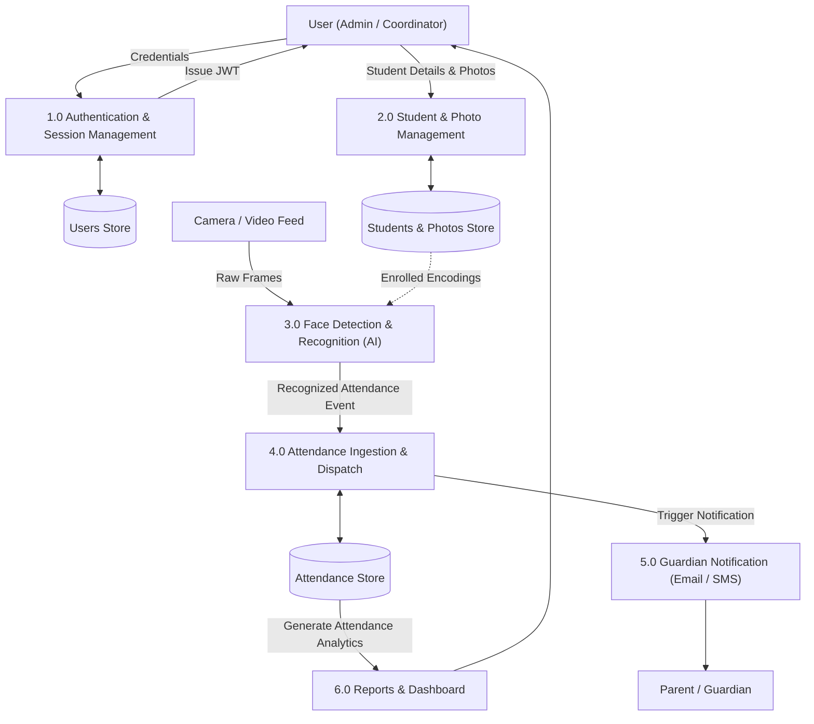

# Data Flow Diagram (DFD) - Level 1

```mermaid
flowchart TD
    User["User (Admin / Coordinator)"] -->|Credentials| P1["1.0 Authentication & Session Management"]
    P1 -->|Issue JWT| User
    P1 <--> DB1[("Users Store")]

    User -->|Student Details & Photos| P2["2.0 Student & Photo Management"]
    P2 <--> DB2[("Students & Photos Store")]

    Camera["Camera / Video Feed"] -->|Raw Frames| P3["3.0 Face Detection & Recognition (AI)"]
    DB2 -.->|Enrolled Encodings| P3
    P3 -->|Recognized Attendance Event| P4["4.0 Attendance Ingestion & Dispatch"]

    P4 <--> DB3[("Attendance Store")]
    P4 -->|Trigger Notification| P5["5.0 Guardian Notification (Email / SMS)"]
    P5 --> Guardians["Parent / Guardian"]
    DB3 -->|Generate Attendance Analytics| P6["6.0 Reports & Dashboard"]
    P6 --> User
```
