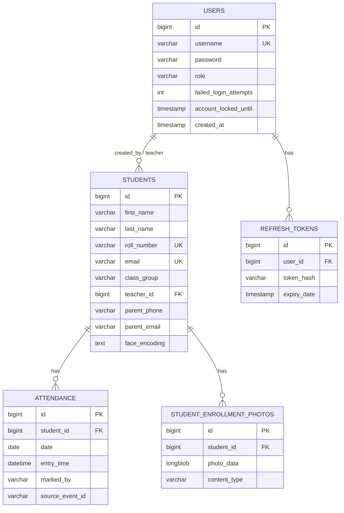

# Entity Relationship (ER) Diagram

```mermaid
erDiagram
    USERS ||--o{ STUDENTS : "created_by / teacher"
    STUDENTS ||--o{ ATTENDANCE : "has"
    STUDENTS ||--o{ STUDENT_ENROLLMENT_PHOTOS : "has"
    USERS ||--o{ REFRESH_TOKENS : "has"

    USERS {
        bigint id PK
        varchar username UK
        varchar password
        varchar role
        int failed_login_attempts
        timestamp account_locked_until
        timestamp created_at
    }

    STUDENTS {
        bigint id PK
        varchar first_name
        varchar last_name
        varchar roll_number UK
        varchar email UK
        varchar class_group
        bigint teacher_id FK
        varchar parent_phone
        varchar parent_email
        text face_encoding
    }

    ATTENDANCE {
        bigint id PK
        bigint student_id FK
        date date
        datetime entry_time
        varchar marked_by
        varchar source_event_id
    }

    STUDENT_ENROLLMENT_PHOTOS {
        bigint id PK
        bigint student_id FK
        longblob photo_data
        varchar content_type
    }

    REFRESH_TOKENS {
        bigint id PK
        bigint user_id FK
        varchar token_hash
        timestamp expiry_date
    }
```
